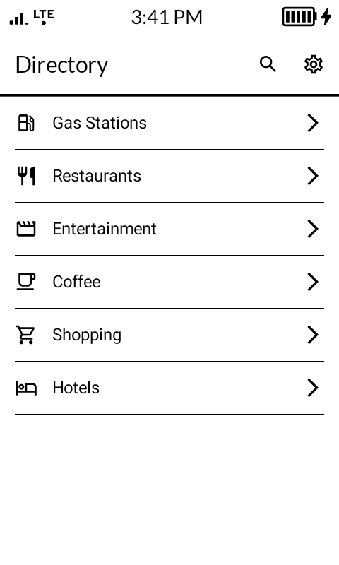
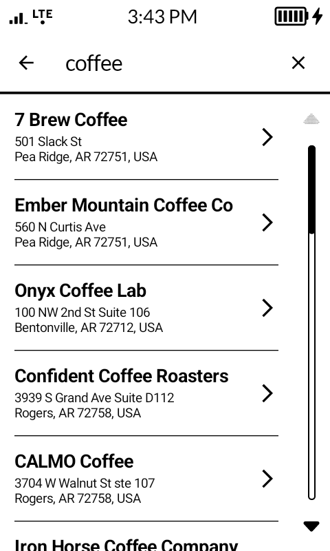
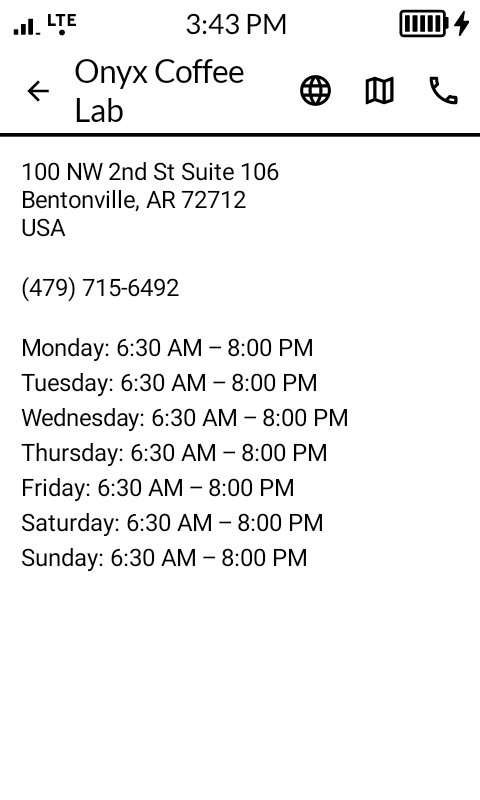
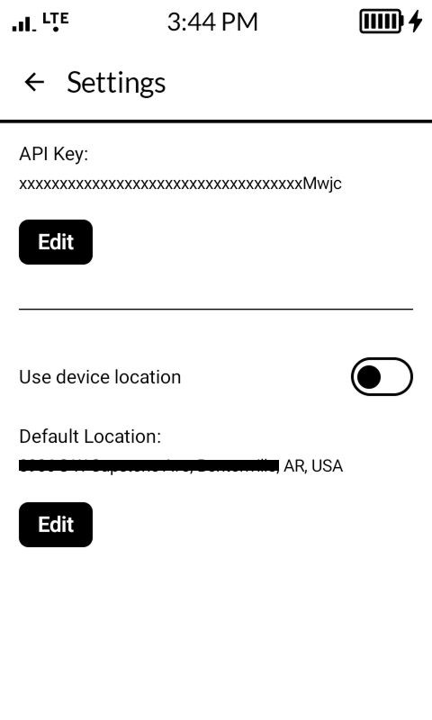

# CalmDirectory

**CalmDirectory** is an Android directory application built with Jetpack Compose, optimized for E-ink displays using the **Mudita Mindful Design (MMD)** library. The app provides a minimalist, distraction-free interface for searching points of interest (POIs) such as restaurants, gas stations, hotels, and more.

## Screenshots

| Landing Screen | Search Results | POI Details Screen | Settings Screen                                     |
|---|---|---|-----------------------------------------------------|
|  |  |  |  |

## Table of Contents

- [Overview](#overview)
- [Mudita Mindful Design (MMD) Integration](#mudita-mindful-design-mmd-integration)
  - [What is MMD?](#what-is-mmd)
  - [E-ink Optimization Principles](#e-ink-optimization-principles)
  - [MMD Components Used](#mmd-components-used)
- [E-ink Display Considerations](#e-ink-display-considerations)
- [Technical Stack](#technical-stack)
- [Setup and Installation](#setup-and-installation)
- [Architecture](#architecture)
- [Usage](#usage)
- [API Configuration](#api-configuration)
- [Contributing](#contributing)

---

## Overview

CalmDirectory is designed with mindfulness and digital wellness at its core. By leveraging the Mudita Mindful Design library, the app provides an optimal experience for E-ink devices, minimizing visual noise, eliminating unnecessary animations, and maximizing readability.

**Key Features:**
- E-ink optimized UI with monochromatic color scheme
- Minimal animations to reduce E-ink ghosting
- High-contrast typography for better readability
- Location-based POI search using Google Places API
- Manual and device-based location selection
- Category-based browsing (restaurants, gas stations, hotels, etc.)

---

## Mudita Mindful Design (MMD) Integration

### What is MMD?

The **Mudita Mindful Design (MMD)** library is a custom Material Design component library specifically optimized for E-ink displays and mindful user experiences. It extends Jetpack Compose with components that prioritize:

- **Readability**: High contrast, optimized typography
- **Minimalism**: Clean interfaces without visual clutter
- **Performance**: Reduced animations to prevent E-ink ghosting
- **Mindfulness**: Distraction-free design patterns

**Dependency:**
```gradle
implementation 'com.mudita:MMD:1.0.0'
```

### E-ink Optimization Principles

CalmDirectory implements several E-ink optimization strategies through MMD:

#### 1. **Monochromatic Color Scheme**
E-ink displays excel with black and white content. The app uses `eInkColorScheme` which provides:
- Pure black text on white backgrounds
- High contrast ratios for readability
- No color gradients that can cause artifacts

```kotlin
ThemeMMD(
    colorScheme = eInkColorScheme,
    content = content
)
```

#### 2. **Optimized Typography**
MMD's `eInkTypography` provides font styles specifically tuned for E-ink readability:
- Increased font weights for better contrast
- Larger default sizes to reduce eye strain
- Optimized line heights and letter spacing

```kotlin
typography = eInkTypography.copy(
    headlineLarge = TextStyle(
        fontSize = 28.sp,
        fontWeight = FontWeight.SemiBold,
        color = Color.Black
    ),
    bodyLarge = TextStyle(
        fontSize = 18.sp,
        fontWeight = FontWeight.Normal,
        color = Color.Black
    )
)
```

#### 3. **Disabled Ripple Effects**
Ripple animations cause ghosting on E-ink displays. MMD automatically disables ripple effects by default, replacing them with instant feedback mechanisms.

#### 4. **Minimized Animations**
E-ink displays have slow refresh rates (typically 100-200ms). MMD components minimize or eliminate animations to prevent:
- Ghosting artifacts
- Visual latency
- User confusion

#### 5. **Sharp Boundaries and Clear Dividers**
MMD emphasizes clear visual separation using dividers and borders rather than shadows or elevation, which render poorly on E-ink:

```kotlin
HorizontalDividerMMD(
    thickness = 2.dp,
    color = MaterialTheme.colorScheme.outlineVariant
)
```

### MMD Components Used

CalmDirectory utilizes the following MMD components throughout the application:

#### **LazyColumnMMD**
Optimized lazy list rendering with:
- Instant scrolling (no momentum scrolling)
- Clear item boundaries
- Efficient recomposition for E-ink displays

**Usage in Landing Screen:**
```kotlin
LazyColumnMMD(modifier = modifier) {
    items(poiCategories) { category ->
        // Category items
        HorizontalDividerMMD(thickness = 1.dp)
    }
}
```

#### **TopAppBarMMD**
E-ink optimized top app bar with:
- High contrast title and icon rendering
- No elevation shadows
- Clear visual separation from content

**Usage in Main Activity:**
```kotlin
TopAppBarMMD(
    title = { Text("Directory") },
    navigationIcon = { /* Back button */ },
    actions = { /* Action icons */ }
)
```

#### **ButtonMMD**
Button component designed for E-ink with:
- High contrast borders
- No gradient backgrounds
- Instant press feedback (no ripple)
- Clear visual states (pressed/unpressed)

**Usage in Settings:**
```kotlin
ButtonMMD(onClick = { 
    userPreferencesRepository.saveApiKey(newApiKey)
}) {
    Text("Save")
}
```

#### **TextFieldMMD**
Input field optimized for E-ink displays:
- High contrast borders
- Clear focus indicators
- No animated label transitions
- Instant cursor rendering

**Usage in Settings Screen:**
```kotlin
TextFieldMMD(
    value = newApiKey,
    onValueChange = { newApiKey = it },
    label = { Text("API Key") }
)
```

#### **SwitchMMD**
Toggle switch with E-ink optimizations:
- Clear on/off states
- No transition animations
- High contrast thumb and track

**Usage for Location Toggle:**
```kotlin
SwitchMMD(
    checked = useDeviceLocation,
    onCheckedChange = { viewModel.setUseDeviceLocation(it) }
)
```

#### **SearchBarDefaultsMMD**
Search input component with:
- Optimized keyboard interactions
- Clear text rendering
- Instant query updates

**Usage in Top App Bar:**
```kotlin
SearchBarDefaultsMMD.InputField(
    query = searchQuery,
    onQueryChange = { searchViewModel.onSearchQueryChange(it) },
    expanded = true,
    placeholder = { Text("Search for a place") }
)
```

#### **CircularProgressIndicatorMMD**
Loading indicator designed for E-ink:
- Simplified animation or static frames
- High contrast rendering
- Minimal refresh cycles

**Usage in Search Screen Host:**
```kotlin
CircularProgressIndicatorMMD()
```

#### **HorizontalDividerMMD**
Visual separator optimized for E-ink:
- Configurable thickness
- Sharp rendering
- No anti-aliasing artifacts

**Usage Throughout:**
```kotlin
HorizontalDividerMMD(
    modifier = Modifier.padding(horizontal = 16.dp),
    thickness = 1.dp
)
```

#### **SnackbarHostStateMMD**
Notification system with E-ink considerations:
- Simple appearing/disappearing (no slide animations)
- High contrast messages
- Clear dismissal

**Usage in Settings:**
```kotlin
val snackbarHostState = remember { SnackbarHostStateMMD() }
snackbarHostState.showSnackbar("API Key saved successfully")
```

---

## E-ink Display Considerations

### Design Decisions for E-ink

#### **Layout Choices**
- **List-based navigation**: Vertical scrolling is more natural on E-ink than complex grid layouts
- **Full-width elements**: Minimizes partial refreshes
- **Clear hierarchies**: Strong visual structure with dividers and whitespace

#### **Typography**
- **Larger fonts**: 18sp for body text, 28sp for headlines
- **Increased font weights**: SemiBold for emphasis
- **No subpixel rendering**: Sharp, whole-pixel boundaries

#### **Interaction Patterns**
- **Single-tap actions**: No long-press or swipe gestures that require visual feedback
- **Instant state changes**: Toggle switches and buttons show immediate state
- **Clear affordances**: Icons and text clearly indicate interactivity

#### **Content Strategy**
- **Text-first**: Information conveyed through text rather than icons alone
- **Monochrome icons**: Material Icons work well on E-ink
- **Concise information**: Dense information display to minimize scrolling

### Testing on E-ink Devices

CalmDirectory has been optimized for:
- E-ink Android tablets (e.g., Onyx Boox, reMarkable, Mudita devices)
- Devices with monochrome displays
- Low refresh rate screens (10-15 Hz)

**Testing Recommendations:**
1. Enable "Show layout bounds" in Developer Options to verify alignment
2. Test with device-specific E-ink modes (A2, X mode, etc.)
3. Verify text remains readable at minimum brightness
4. Confirm no ghosting occurs during normal navigation

---

## Technical Stack

- **Language**: Kotlin 1.9.22
- **UI Framework**: Jetpack Compose 1.7.3
- **Design Library**: Mudita Material Design (MMD) 1.0.0
- **Build System**: Gradle 8.3.0
- **Architecture**: MVVM with StateFlow
- **Navigation**: Jetpack Compose Navigation
- **Data Persistence**: DataStore Preferences
- **Networking**: 
  - Google Places SDK for Android 3.5.0
  - Ktor Client 2.3.2
  - Retrofit 2.9.0
- **Min SDK**: 28 (Android 9.0 Pie)
- **Target SDK**: 35 (Android 15)

---

## Setup and Installation

### Prerequisites

1. **Android Studio** (latest stable version)
2. **JDK 17**
3. **Gradle 8.3.0** (system installation)
4. **Google Places API Key** ([Get one here](https://console.cloud.google.com/apis/credentials))

### Installation Steps

1. **Clone the repository:**
   ```bash
   git clone https://github.com/yourusername/CalmDirectory.git
   cd CalmDirectory
   ```

2. **Configure the MMD library:**
   
   The MMD library (`com.mudita:MMD:1.0.0`) must be available in your local Maven repository or configured via a custom repository. Add to `settings.gradle`:
   
   ```gradle
   dependencyResolutionManagement {
       repositories {
           google()
           mavenCentral()
           maven { url 'https://mudita.jfrog.io/artifactory/mmd-release' } // Example
       }
   }
   ```

3. **Build the project:**
   ```bash
   gradle build
   ```

4. **Run on an emulator or device:**
   ```bash
   gradle installDebug
   adb shell am start -n com.example.helloworld/.MainActivity
   ```

### First Launch Setup

On first launch, the app will prompt you to:
1. Enter your Google Places API key
2. Configure location preferences (device location or manual entry)

---

## Architecture

### MVVM Pattern with MMD

CalmDirectory follows MVVM architecture optimized for E-ink rendering:

```
┌─────────────────────────────────────┐
│         UI Layer (Compose)          │
│    ┌──────────────────────────┐    │
│    │  MMD Components          │    │
│    │  - LazyColumnMMD         │    │
│    │  - ButtonMMD             │    │
│    │  - TextFieldMMD          │    │
│    │  - TopAppBarMMD          │    │
│    └──────────────────────────┘    │
│    ┌──────────────────────────┐    │
│    │  Theme (CalmDirectory)   │    │
│    │  - eInkColorScheme       │    │
│    │  - eInkTypography        │    │
│    └──────────────────────────┘    │
└─────────────────────────────────────┘
               ↕
┌─────────────────────────────────────┐
│        ViewModel Layer               │
│  - MainViewModel                     │
│  - SearchViewModel                   │
│  - SettingsViewModel                 │
│  (StateFlow for reactive state)      │
└─────────────────────────────────────┘
               ↕
┌─────────────────────────────────────┐
│          Data Layer                  │
│  - UserPreferencesRepository         │
│  - LocationRepository                │
│  - GooglePlacesApiService            │
│  - LocationService                   │
└─────────────────────────────────────┘
```

### Key Files

- **`Theme.kt`**: MMD theme configuration with E-ink optimizations
- **`LandingScreen.kt`**: Category grid using `LazyColumnMMD`
- **`SearchScreen.kt`**: POI search results with MMD components
- **`SettingsScreen.kt`**: Configuration screen with `TextFieldMMD`, `SwitchMMD`, `ButtonMMD`
- **`MainActivity.kt`**: Navigation host with `TopAppBarMMD`

---

## Usage

### Category Browsing
1. Launch the app
2. Select a category (Gas Stations, Restaurants, etc.)
3. View results based on your current or default location

### Free-Text Search
1. Tap the search icon in the top bar
2. Enter any search query (e.g., "pizza near me")
3. Browse results and tap to view details

### Location Configuration
1. Navigate to Settings
2. Toggle "Use device location"
   - **ON**: Uses GPS/network location
   - **OFF**: Enter a default location manually (e.g., "New York, NY")
3. Location autocomplete provides suggestions

### POI Details
- View full information: address, phone, hours, description
- Tap icons to:
  - Open website
  - View on map
  - Call phone number

---

## API Configuration

### Google Places API Key Setup

1. **Create a Google Cloud Project:**
   - Go to [Google Cloud Console](https://console.cloud.google.com/)
   - Create a new project or select existing

2. **Enable APIs:**
   - Enable "Places API (New)"
   - Enable "Places SDK for Android"
   - Enable "Geocoding API"

3. **Create API Key:**
   - Navigate to Credentials
   - Create API Key
   - Restrict key to Android apps (add your package name: `com.example.helloworld`)

4. **Configure in App:**
   - On first launch, enter key in the settings screen
   - Key is stored locally in DataStore

### API Key Storage

API keys are stored securely using DataStore Preferences:
```kotlin
class UserPreferencesRepository(context: Context) {
    private val dataStore = context.dataStore

    val apiKey: Flow<String?> = dataStore.data
        .map { preferences -> preferences[API_KEY] }

    suspend fun saveApiKey(apiKey: String) {
        dataStore.edit { preferences ->
            preferences[API_KEY] = apiKey
        }
    }
}
```

---

## Contributing

Contributions are welcome! When contributing to CalmDirectory, please keep the following principles in mind:

### E-ink Design Guidelines

1. **Maintain monochromatic design**: No colors, gradients, or low-contrast elements
2. **Use MMD components**: Prefer MMD components over standard Material3 components
3. **Minimize animations**: Avoid any animated transitions
4. **Test on E-ink**: If possible, test changes on actual E-ink devices
5. **Sharp rendering**: Ensure all UI elements have clear, pixel-aligned boundaries

### Code Conventions

- Follow existing MVVM patterns
- Use StateFlow for reactive state
- Keep ViewM- odels free of Android framework dependencies
- Document E-ink optimizations in comments

### Pull Request Process

1. Fork the repository
2. Create a feature branch (`feature/your-feature-name`)
3. Implement changes following E-ink guidelines
4. Test thoroughly on both regular and E-ink displays if available
5. Submit PR with description of changes and screenshots

---

## License

[Specify your license here]

---

## Acknowledgments

- **Mudita** for the Mindful Design library
- **Google** for Places API
- E-ink Android community for optimization insights

---

## Support

For issues, questions, or feature requests:
- Open an issue on GitHub
- Include device type (especially if E-ink)
- Attach screenshots demonstrating the issue

---

**Built with mindfulness for a calmer digital experience.**
